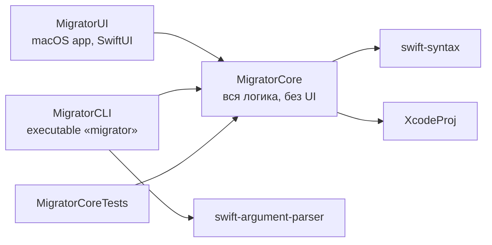
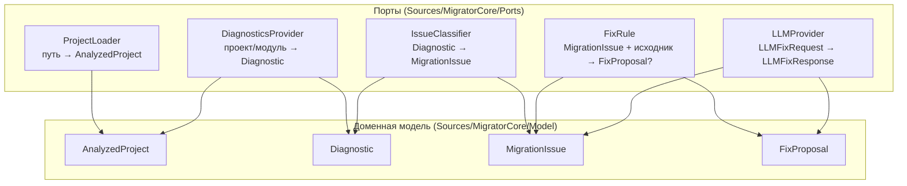

# Архитектура SwiftMigrator

## Таргеты



`MigratorCore` не импортирует SwiftUI/AppKit — логика тестируется без запуска
приложения, CLI и UI — тонкие обёртки над ядром.

## Порты (ports & adapters)

Ядро объявляет протоколы-порты; реализации-адаптеры приходят на этапах 1–3
и подставляются через DI. Каждый порт имеет мок в тестовом таргете — этапы
разрабатываются независимо и тестируются без компилятора, файловой системы и сети.



Порты зависят **только от доменной модели** и друг на друга не ссылаются;
конкретных реализаций в ядре нет. Данные текут по конвейеру:

```text
путь → ProjectLoader → AnalyzedProject
     → DiagnosticsProvider → [Diagnostic]
     → IssueClassifier → [MigrationIssue]
     → по маршруту: FixRule | LLMProvider | вручную
     → FixProposal (proposed → applied/rejected/failed)
```

## Будущие адаптеры (реализации портов)

| Порт | Реализация | Этап |
| --- | --- | --- |
| ProjectLoader | SPMProjectLoader (Package.swift), XcodeProjLoader (.xcodeproj) | 1 |
| DiagnosticsProvider | сборка с `-strict-concurrency=complete`, парсинг вывода | 1 |
| IssueClassifier | таблица правил по кодам диагностик + AST-анализ | 2 |
| FixRule | @MainActor для UI-наследников, Sendable для immutable structs, var→let, @preconcurrency import | 2 |
| LLMProvider | клиент API + мок с закэшированными ответами для демо | 3 |
